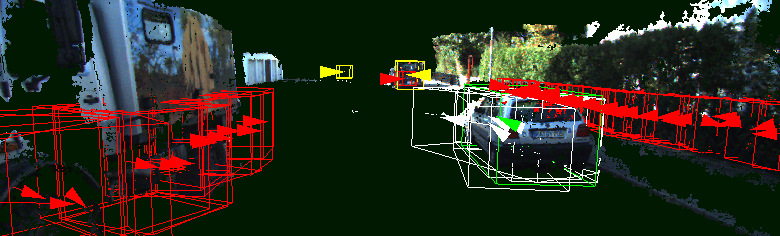

PyDriver
========

What is PyDriver?
  PyDriver is a Python (2.7, 3.x) framework for training and evaluating object detectors
  and classifiers in road traffic environment. It aims at researchers experimenting
  with learning based 3D object detection, classification and tracking.

What can I do with PyDriver?
  PyDriver helps you with following tasks:

  - read data from standard datasets (currently integrated: `KITTI <http://www.cvlibs.net/datasets/kitti/>`_)
  - reconstruct 3D scene from stereo images, detect/remove ground plane, restrict viewport etc.
  - detect 3D keypoints and extract 3D feature descriptors
  - train classifiers available in `scikit-learn <http://scikit-learn.org/>`_ (support vector machines, decision trees and many more)
  - visualize point clouds, extracted keypoints and detections using `Point Cloud Library <http://pointclouds.org/>`_
  - evaluate produced detections with respect to dataset ground truth

  Of course, you can write your own modules and enhancements such as interfaces to
  your custom dataset or implement novel feature descriptors. The point of PyDriver
  is to provide a basic pipeline for object detection which you can enhance with your
  own algorithms without reimplementing the routine stuff.

Which licence does PyDriver use?
  PyDriver is subject to the MIT licence.

How do I install PyDriver?
  `PyDriver installation documentation <http://lpltk.github.io/pydriver/installation.html>`_

Where are the docs?
  `PyDriver documentation <http://lpltk.github.io/pydriver/>`_

Where is the source?
  The most current development version is available here: http://github.com/lpltk/pydriver
